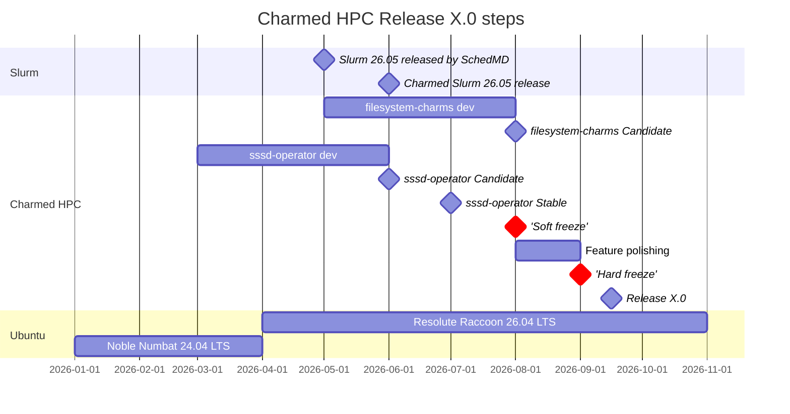

# Release policy for Charmed HPC

## Abstract

This spec details the release policy for Charmed HPC.

## Rationale

A consistent release policy is necessary to keep our community aware of upcoming major changes, bug fixes, and security updates, while ensuring that the community has some expected degree of stability.

Since Charmed HPC is a composition of multiple charms and artifacts, there must be a well-defined release policy that developers and users can reference to know when they can expect new features, bug fixes, security updates, and compatibility guarantees across the set of charms.

## Specification

## Artifacts

Charmed HPC artifacts:

<!-- Update this list as the Charmed HPC portfolio evolves -->

- Charmed Slurm (see [UHPC 003](../UHPC%20003%20-%20Release%20policy%20and%20notes%20for%20Charmed%20Slurm/uhpc-003.md))
- filesystem-charms
- sssd-operator

### Versioning scheme

Version format: `<major release>.<patch version #>`. Example Charmed HPC release numbers:

- Initial release: "1.0"
- Bugfix release: "1.1"
- Security update: "1.2"

* Major release - new features, new Ubuntu base version, updated artifact versions
* Minor release - bug and security fixes only
  * Note that running `juju refresh` is necessary to pull the latest security and bug fix updates

## Release cadence

<!-- Charmed HPC releases will follow a regular cadence aligned with the Ubuntu LTS release cycle. Each Charmed HPC release will target the current Ubuntu LTS release as its primary base. -->

Individual components within Charmed HPC (e.g. Charmed Slurm) may follow their own upstream-driven release cadences as defined in their respective specs. Since Charmed HPC is a set of charms rather than a single deployable artifact, a Charmed HPC release defines a tested, compatible set of charm versions that are verified to work together.

### Release channels and branches

Since Charmed HPC is a set of charms rather than a single charm, release channels apply to each constituent charm individually.

* Each track has a corresponding GitHub branch, e.g. "25.11"
* Each track on Charmhub provides three channels:
   * Edge, the development channel
   * Candidate, to test the new release before publishing
   * Stable
     * No breaking changes will be made to integrations, configuration options, or actions in a stable channel of a charm

### Release cycle and feature freezes

At a predetermined time, a 'soft' freeze point will be established; by this time, the current edge channel of each artifact for the current pre-release track must be pushed to Candidate. Following this push, any updates would be solely to resolve issues/bugs/etc. with the Candidate, ending with the 'hard' freeze.

Given the variety of charms, the Candidate/Stable for a given charm may be the same as for the prior release.




## Support life-cycle

Outside exceptional circumstances, each Charmed HPC release will receive bug and security fix support for [TBD].

<!-- Components that track upstream projects (e.g. Charmed Slurm tracking SchedMD's Slurm) will follow the support life-cycle defined in their respective release policies. -->


## Documentation

Warnings/limitations that will be included in the published documentation alongside the release notes:

* Due to potential breaking changes between major releases, Charmed HPC cannot guarantee backwards compatibility with previous major versions
  * If a user requirement necessitates artifact versions that are not from a single release, they should open an issue on GitHub (or Discourse) and work with the team

#### Release Notes Template

````
# Charmed HPC <major release>.<patch version #> Release Notes

Release date: YYYY-MM-DD

## Summary

Brief overview of this release, including the primary focus (e.g., new Ubuntu base, 
new artifact versions, bug fixes, security updates).

## Artifacts in this release

| Artifact | Track | Revision | Notes |
|----------|-------|----------|-------|
| Charmed Slurm | <track> | <revision> | See [Charmed Slurm release notes] |
| filesystem-charms | <track> | <revision> | |
| sssd-operator | <track> | <revision> | |

## Underlying dependencies

| Dependency | Version | Notes |
|------------|---------|-------|
| charmed-hpc-libs | <version> | |

## What's new

### New features

- Feature description and the artifact(s) it affects.

### Improvements

- Improvement description.

## Requirements and compatibility

### Supported Ubuntu bases

- Ubuntu <version> LTS (Noble Numbat / etc.)

### Juju version

- Minimum Juju version: <version>

## Backwards incompatible changes

- Change description and required user action, if any.

## Deprecated features

- Feature or option that is deprecated, with recommended alternative.

## Known issues

- Issue description and any available workaround.

## Upgrade notes

### Upgrading from <previous major release>.x

Instructions or considerations for upgrading from the previous major release.

### Refreshing charms

```bash
juju refresh <charm-name> --channel <track>/stable
```

## Support lifecycle

| Release | Release date | End of support |
|---------|--------------|----------------|
| <major release>.0 | YYYY-MM-DD | YYYY-MM-DD |

Bug and security fix support is provided for [TBD] months after release.

## References

- [Charmed HPC release policy](link to this spec)
- [Charmed Slurm release notes](link)
````

## Release notes sections

General release notes sections for Charmed HPC:

* Release summary
* Artifacts and versions included in the release
* What's new (features and improvements)
* Requirements and compatibility (Ubuntu base, Juju version, Charmhub tracks)
* Backwards incompatible changes
* Deprecated features
* Known issues
* Upgrade notes (including `juju refresh` instructions)
* Support lifecycle

## References

* [UHPC 003 - Release policy for Charmed Slurm](../UHPC%20003%20-%20Release%20policy%20and%20notes%20for%20Charmed%20Slurm/uhpc-003.md)
* [Canonical product release cycles](https://ubuntu.com/about/release-cycle#ubuntu)
