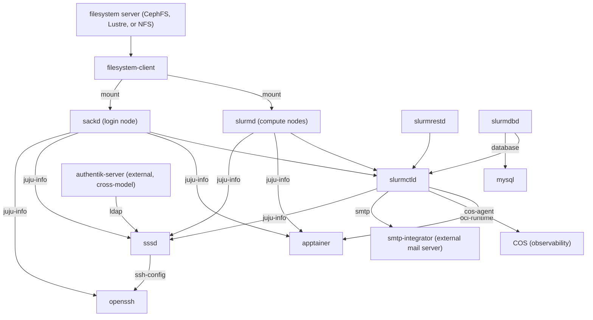

# Charm and solution promotion criteria for Charmed HPC

## Abstract

This specification defines what testing and release hygiene must be satisfied to
promote Charmed HPC artifacts along the Charmhub risk ladder
`edge -> beta -> candidate -> stable`. It covers two levels:

- **Single charm**: the criteria that govern promotion of an individual Ubuntu Juju
  charm, using the `canonical/slurm-charms` monorepo (`slurmctld`, `slurmd`,
  `slurmdbd`, `sackd`, `slurmrestd`) as the worked example.
- **Charmed HPC solution (multi-charm)**: the cross-charm criteria that only make
  sense when the constituent charms are deployed together. The solution criteria
  build on the single-charm criteria: a solution promotion assumes each constituent
  charm has independently satisfied the single-charm gates for the same target
  channel, and adds the cross-charm gates on top.

## Rationale

Charmed HPC is composed of multiple cooperating charms that are released and promoted
independently, yet consumed together as a solution. Without a well-defined promotion
process at both levels, it is difficult to know what evidence justifies moving a
specific artifact from one risk channel to the next, or to reason about the maturity
of the solution as a whole.

A shared, reusable set of promotion criteria lets each component maintainer promote
their charm against consistent gates, and lets the solution owner reason about the
combined stack using the **weakest-link rule** (the solution is only as mature as its
least-mature required constituent). This keeps promotions deliberate and auditable
rather than ad-hoc judgement.

The model is grounded in:

- The Charmhub [track + risk channel](https://juju.is/docs/juju/channel) release model.
- The [Charmed HPC contributing guide](https://github.com/canonical/hpc-team/blob/main/CONTRIBUTING.md).
- Common industry progressive-delivery practice (alpha/beta/RC/GA with bake time,
  long-duration reliability testing, and staged sign-off).

## Specification Part A: Single-charm promotion criteria

### A.1 Purpose and scope

This part defines what testing and release hygiene must be satisfied to promote
a single Ubuntu Juju charm along the Charmhub risk ladder:

```
edge  ->  beta  ->  candidate  ->  stable
```

It is written to be reusable for any single charm, and uses the `canonical/slurm-charms`
monorepo (`slurmctld`, `slurmd`, `slurmdbd`, `sackd`, `slurmrestd`) as the worked
example. Part B layers additional cross-charm gates on top of this one for the full
Charmed HPC solution.

#### A.1.1 What a "promotion" is

A promotion moves a **specific charm revision** from one risk channel to the next
*within the same track* (for example, `latest/edge` -> `latest/beta`, or
`24.11/beta` -> `24.11/candidate`). Promotion never rebuilds the artifact: the same
revision that passed the lower channel is what gets released to the higher one. This
is the standard "build once, promote the artifact" principle.

### A.2 Channel and versioning model

#### A.2.1 Risk channels (the promotion ladder)

| Channel     | Audience                         | Intent                                                      | Stability contract |
|-------------|----------------------------------|------------------------------------------------------------|--------------------|
| `edge`      | Charm developers, CI             | Every merge to the tracked branch; may break at any time    | None |
| `beta`      | Early adopters, integration labs | Feature-complete for this version increment; functional testing against the target base achieved | Deploys and passes full functional tests |
| `candidate` | Release validators, operators evaluating an upgrade | Release candidate after extended reliability testing; no known critical defects    | Production-shaped; upgrade and rollback verified |
| `stable`    | Production users                 | Supported, documented, scale-tested, backwards-compatible release         | Full support contract; safe sequential upgrades |

#### A.2.2 Tracks

A Charmhub **track** groups a compatible line of the charm. For charms with an
upstream project that follows its own major/minor versioning (such as the Slurm
charms), tracks follow that upstream line, e.g. a `YY.MM` track (`track/25.11` in
git) plus `latest` for the current development line. Not every charm has an
upstream to track this way; for those, `latest` may be the only track, or tracks
may instead mark some other compatibility boundary (for example, a supported
Ubuntu base or a breaking change to a relation interface).

Guidance:

- **One track per independently-promoted compatibility line** (e.g. per supported
  Slurm major line, where applicable).
- A single track/channel can support multiple Ubuntu bases and architectures at
  once (per the `platforms` entries in `charmcraft.yaml`); the base/architecture is
  not itself part of the track. Adding a new base or architecture is a new platform
  matrix entry that must re-clear the gates below.
- `latest` maps to the `main` git branch; `YY.MM` maps to `track/YY.MM`.

### A.3 Testing dimensions

Each dimension is a class of evidence that a promotion gate can require. Test
plans for these dimensions use the test plan types defined in OO001:
**functional**, **solution**, **performance**, **reliability**, and **security**.
Functional tests should be written in BDD style for clarity and maintainability.

| Dimension            | OO001 type  | Question it answers                             | Tooling |
|----------------------|-------------|-------------------------------------------------|---------|
| **Unit**             | N/A | Does the charm logic behave correctly in isolation | `pytest` + `ops.testing` (Scenario/Context) via `just unit` |
| **Integration**      | functional  | Does the charm deploy, relate, and run against a live Juju/LXD | `jubilant` via `just integration` |
| **Functional**       | functional  | Does the charm satisfy user-facing behaviors end to end | `jubilant` today; full scenario coverage *(target)* |
| **Upgrade / refresh**| functional  | Can users move between revisions without data/config loss | `juju refresh` across revisions in a `jubilant` test *(target for full matrix)* |
| **Multi-charm**      | solution    | Does it cooperate with the charms it integrates with | See Part B |
| **Performance**      | performance | Does it meet scale and performance baselines    | `charmed-hpc-benchmarks` |
| **Reliability**      | reliability | Does it stay healthy under failure and sustained load (HA) | `--run-high-availability`; scheduled sustained-load runs |
| **Security**         | security    | Is the artifact free of unresolved critical/high vulnerabilities | CVE/dependency scans |

#### A.3.1 Definitions

- **Unit tests** exercise charm handlers, config, actions, and libraries with a mocked
  Juju model. Every charm **action** must have unit coverage. 
- **Integration tests** deploy the packed charm to a real controller, form its
  relations, and assert active/idle status plus basic workload function. The minimal
  deploy-and-verify subset of these tests is used as a fast *functional* gate before
  deeper testing.
- **Functional tests** express behaviors as `Given/When/Then` scenarios that a
  non-developer stakeholder can read (e.g. "Given a running cluster, When a user submits
  a batch job, Then it completes and returns output").
- **Upgrade / refresh tests** deploy revision N-1 (or previous stable), `juju refresh`
  to the candidate revision, and assert data/config preservation and healthy status.
  Rollback tests refresh back down and assert recovery.
- **Multi-charm (solution) tests** verify the charm against the other charms and
  products it integrates with. 
- **Performance tests** cover horizontal/vertical scale and a performance baseline
  with an agreed regression budget. 
- **Reliability tests** cover HA failover and resilience in non-ideal scenarios, and
  sustained, representative load over an extended period (multi-hour to multi-day) to
  detect memory leaks, resource exhaustion, restarts, and status flaps.
- **Security tests** cover CVE/dependency scanning of the artifact and its
  dependencies, and checks that non-admin users cannot perform privileged
  operations. 

### A.4 Per-channel promotion gates

Legend: **[CI]** enforced automatically in CI; **[MAN]** manual sign-off; **[CI/MAN]**
CI-produced evidence that a human reviews. *(target)* = not yet implemented in-repo.

#### A.4.1 Promote to `edge`

Trigger: merge to the tracked branch (`main` or `track/*`). Fully automated.

- [CI] Static checks pass: `just check` (format, lint, typecheck).
- [CI] Unit tests pass: `just unit`.
- [CI] Unit coverage >= **85%** line coverage (proposed default; enforced via the
  coverage report / TICS) *(target: fail the build below threshold)*.
- [CI] Charm packs successfully for every supported base (`just repo stage <charm>`
  + `charmcraft pack`).
- [CI] Minimal functional integration: deploy + reach `active/idle` on at least one
  base (a minimal subset of `just integration`, e.g. selected by a pytest marker;
  see A.3.1).
- [CI] `commitlint` checks pass.
- [CI] Auto-published to `<track>/edge` (`canonical/charming-actions/upload-charm`).

#### A.4.2 Promote to `beta`

Intent: feature-complete for this increment and known-good on the target base.

Requires everything in `edge`, plus:

- [CI] **Full** integration suite green on every supported base: `just integration`.
- [CI] Every charm **action** is exercised by an integration or unit test.
- [CI] Every `provides`/`requires` relation is exercised by an integration test
  (relation data flows and both sides settle).
- [CI] **Reliability / HA (single-charm)** suite passes:
  `just integration -- --run-high-availability` (leader loss and `slurmctld` failover
  recover the charm to healthy on its own). Job survival across failover with the rest
  of the stack live is a solution gate, see B.3.2.
- [CI] **Security check (single-charm)**: CVE/dependency scan of the
  artifact and its Python/OS dependencies with **no unresolved critical/high**
  findings.
- [CI] **Functional** acceptance scenarios pass, covering the charm's primary user
  journeys *(target)*.
- [CI/MAN] Coverage has not regressed versus the current `beta` revision (or the
  previous revision, if none is on `beta` yet).
- [MAN] Draft documentation exists for any new config/action/relation (a paired PR in
  `charmed-hpc-docs`, per the contributing guide).
- [CI] The **Nightly run** tests pass.
- [MAN] No open **critical or high** severity bugs against the revision.

#### A.4.3 Promote to `candidate`

Intent: a release candidate under extended reliability testing; production-shaped and upgrade-safe.

Requires everything in `beta`, plus:

- [CI] **Upgrade matrix** passes *(target)*:
  - refresh from **previous stable** -> candidate,
  - refresh from **previous beta/candidate** -> candidate,
  - **rollback** candidate -> previous revision recovers cleanly.
- [CI] Operational baseline captured *(target)*:
  - scale up **and** down of applicable applications (units and resources).
  - sustained-load reliability run >= **12h** (single charm) with no
    leaks/restarts/status flaps *(target, depends on Solutions QA)*,
  - performance baseline recorded (regression budget agreed by maintainers).
- [MAN] Documentation drafted: usage, configuration, actions, relations, limitations,
  and any deviation from the non-charmed workload.
- [MAN] Release notes / CHANGELOG entry drafted for the revision.
- [MAN] Backwards-compatibility / interface-stability review: no breaking change to a
  published relation interface without a version/track bump.
- [MAN] Manual QA sign-off on a clean deployment following the documented quickstart.

#### A.4.4 Promote to `stable`

Intent: supported, documented, backwards-compatible general availability.

Requires everything in `candidate`, plus:

- [MAN] **Sustained-load reliability run on `candidate`:** >= **7 days** with **zero
  regressions** and no new critical/high defects (proposed default).
- [CI/MAN] Artifact is reproducible from a tagged, signed commit; the exact revision
  promoted is the one that passed the sustained-load reliability run on `candidate`.
- [CI] Upgrade from the **current `stable`** revision to the new revision verified
  (data + config preserved) *(target)*.
- [MAN] Security sign-off (no unresolved critical/high; SECURITY.md contact current).
- [MAN] Documentation published (not just drafted) and release notes finalized.
- [MAN] Rollback plan documented (which revision to refresh back to, and how).

### A.5 Automation vs. manual sign-off

Recommended posture: automate what is deterministic and cheap; reserve humans
for judgement, long reliability runs, and scale.

| Gate class                         | edge | beta | candidate | stable |
|------------------------------------|:----:|:----:|:---------:|:------:|
| Static checks / unit / functional (minimal) | CI   | CI   | CI        | CI     |
| Full integration + relations             | -    | CI   | CI        | CI     |
| Functional + reliability (HA)            | -    | CI   | CI        | CI     |
| Upgrade / rollback matrix                | -    | CI*  | CI        | CI     |
| Performance (scale, baseline) / reliability (sustained load) | - | - | CI+MAN | MAN |
| Security / CVE scan                     | -    | CI   | CI        | CI+MAN |
| Docs / release notes               | -    | MAN  | MAN       | MAN    |
| Backwards-compat / interface review| -    | -    | MAN       | MAN    |
| Final promotion approval           | auto | MAN  | MAN       | MAN    |

`*` basic single-step upgrade at beta; full matrix at candidate.

Promotion to `beta` and above should be a deliberate action (a maintainer running the
promotion, or an approved workflow_dispatch), never an automatic side effect of a merge.

## Specification Part B: Charmed HPC solution promotion criteria (multi-charm)

This part defines what must be true to promote the **Charmed HPC solution** (a set
of cooperating charms) along the risk ladder `edge -> beta -> candidate -> stable`.

It **builds on** Part A, which governs each individual charm. A solution promotion
assumes each constituent charm has independently satisfied the single-charm gates for
the same target channel; this part adds the **cross-charm** gates that only make sense
when the charms are deployed together.

### B.1 Solution scope

#### B.1.1 Constituent charms

| Component            | Repository                       | Role in the solution |
|----------------------|----------------------------------|----------------------|
| Slurm charms         | `canonical/slurm-charms`         | Workload manager: `slurmctld` (hub), `slurmd`, `slurmdbd`, `sackd`, `slurmrestd` |
| Filesystem charms    | `canonical/filesystem-charms`    | Shared filesystem provider/consumer (NFS, CephFS, Lustre) mounted on cluster nodes |
| SSSD                 | `canonical/sssd-operator`        | Directory-backed authentication / identity across cluster nodes |
| Apptainer            | `canonical/apptainer-operator`   | OCI/container runtime integration for compute nodes |
| OpenSSH               | `canonical/openssh-operator`     | SSH access to login nodes |

External integrations (not part of the solution's own bundle):

| Component | Repository                       | Role in the integration |
|-----------|-----------------------------------|--------------------------|
| MySQL     | `canonical/mysql-operator`       | Accounting database backing `slurmdbd`; required |
| COS       | `canonical/cos-lite`             | Metrics, alerting, dashboards, and logs via `cos-agent`; required |
| Authentik | `canonical/authentik-server-operator` | Upstream OIDC/LDAP identity provider backing SSSD; optional |
| SMTP      | `canonical/smtp-integrator-operator`  | Job status email notifications via an external mail server integrated with `slurmctld`; optional |

COS and Authentik both run cross-model on **Kubernetes** rather than alongside the
machine-based solution, so they are validated starting at the `candidate` gate
(B.3.3) rather than `edge`/`beta`. Authentik is optional
(`authentik-server` + `authentik-worker`, plus `authentik-ldap-outpost` for LDAP).
When in scope, the SMTP integration requires `slurmdbd` to be deployed and
integrated first; otherwise `slurmctld` never leaves `Waiting` status.

Supporting (not deployed as part of the solution, but relied on to build or validate it):

| Component               | Repository                          | Use |
|-------------------------|-------------------------------------|-----|
| Charm libraries         | `canonical/charmed-hpc-libs`        | Shared building blocks (interfaces, conditions framework) that constituent charms are built against |
| Benchmarks / validation | `canonical/charmed-hpc-benchmarks`  | Operational and end-to-end cluster validation |
| Step library            | `canonical/pytest-jubilant-bdd`     | Reusable step handlers for functional gates |
| Documentation           | `canonical/charmed-hpc-docs`        | Solution documentation and release notes |

#### B.1.2 Relation / integration map

This map mirrors the integrations performed in the Charmed HPC
[getting-started tutorial](https://documentation.ubuntu.com/charmed-hpc/latest/getting-started/),
together with the accounting, identity, observability, and mail integrations from the
Charmed HPC how-to guides:



Key cross-charm surfaces to validate:

- `slurmctld` <-> `slurmd`/`slurmdbd`/`sackd`/`slurmrestd` (core Slurm relations).
- `slurmdbd` <-> `mysql` (accounting database).
- Shared filesystem: `filesystem-client` consuming a filesystem server (CephFS, Lustre,
  or NFS), mounted on both compute (`slurmd`) and login (`sackd`) nodes.
- Apptainer installed on `sackd` and `slurmd` (`juju-info`), providing the OCI runtime
  (`oci-runtime`) to `slurmctld` for containerized jobs.
- SSSD installed on `slurmctld`, `slurmd`, and `sackd` (`juju-info`), providing
  directory-backed identity for job submission.
- OpenSSH providing SSH access on the login node (`sackd`), configured by SSSD
  (`ssh-config`).
- Authentik as an external LDAP identity provider feeding SSSD (`ldap`), where required.
- `slurmctld` -> COS for integrated observability.

### B.2 Solution channel model

#### B.2.1 The weakest-link rule

**A solution channel is only as mature as its least-mature required constituent.**

The Charmed HPC solution is considered to be at risk channel `X` only when **every
required charm** is available at channel `X` (or better) on a compatible track, and the
cross-charm gates for `X` in this document pass. For example, the solution cannot be
`candidate` if any required charm is still only at `beta`.

#### B.2.2 Track and version alignment

- Define a **solution version matrix** per solution track: the exact track/channel of
  each constituent charm that composes that solution release.
- All constituents in a given solution release must target a **compatible Ubuntu base**
  and be validated against the **same Juju version(s)**.
- Optional/experimental constituents (e.g. Apptainer, if a deployment does not use
  containers) may lag, but must be explicitly marked optional in the matrix and
  excluded from the required set for that channel.
- External integrations (MySQL, COS, Authentik) are recorded separately and aren't
  subject to the weakest-link rule; each entry lists the validated version and
  confirms the integration is established.

A minimal matrix template:

```
Solution release: __________   Solution channel: __________   Ubuntu base: __________
Juju version(s) validated: __________

Component          Track        Channel      Revision
slurm-charms       __________   __________   __________
filesystem-charms  __________   __________   __________
sssd-operator      __________   __________   __________
openssh-operator   __________   __________   __________
apptainer-operator __________   __________   __________   (optional: yes/no)

External integrations:
mysql              __________   __________   __________
cos                __________   __________   __________
authentik-server   __________   __________   __________   (Kubernetes; cross-model; optional: yes/no)
```

### B.3 Cross-charm gates per channel

Legend: **[CI]** automated; **[MAN]** manual; **[CI/MAN]** CI evidence, human review.
*(target)* = capability to be built (e.g. functional suite, full upgrade matrix).

#### B.3.1 Solution `edge`

- [CI] Every required charm is available at `edge` on a compatible track.
- [CI] Full-stack bundle deploys and reaches `active/idle`: `slurmctld` + `slurmd` +
  `slurmdbd` (+`mysql`) + `sackd` + filesystem + SSSD + OpenSSH on the target base.
- [CI] Core Slurm relations settle (all four `slurmctld` relations, `slurmdbd:database`).

#### B.3.2 Solution `beta`

Requires solution `edge`, plus:

- [CI] All required charms at `beta` (weakest-link rule).
- [CI] **End-to-end functional job** (a minimal check for the assembled solution):
  submit a batch job through the login path
  (`sackd`/`slurmrestd` -> `slurmctld` -> `slurmd`) and confirm it completes.
- [CI] Shared filesystem is mounted on compute + login nodes and is writable from a job.
- [CI] SSSD-provided identity can submit and own a job.
- [CI] A user can SSH into a login node via OpenSSH, authenticated against
  SSSD-provided identity.
- [CI] **Reliability / HA (cross-charm)**: with the full stack live, a running job
  survives an `slurmctld` leader failover and completes, keeping access to the shared
  filesystem and SSSD-provided identity throughout. (Per-charm `slurmctld` failover
  recovery is covered by the single-charm HA gate in A.4.2; this gate adds the
  cross-charm dimension of a job in flight across the wider stack.)
- [CI] **Functional** acceptance of primary cluster journeys *(target)*, e.g.:
  - submit and complete an `sbatch` job that reads/writes the shared filesystem,
  - run a containerized job via Apptainer,
  - authenticate a user through SSSD and run a job as that user,
  - SSH into a login node via OpenSSH and submit a job from an interactive shell,
  - query cluster state through `slurmrestd`.
- [CI] **Composed-set security check**: no **critical/high** issues that appear only
  when the charms are deployed together, e.g. dependency version conflicts across the
  assembled bundle, credentials or secrets exposed over cross-charm relations, or
  network surfaces opened by the composed topology. (Per-charm CVE/dependency scans
  are inherited via the weakest-link rule; this gate covers only what a single charm's
  scan cannot see.)
- [MAN] Deployment documentation drafted for any changed topology or relation.
- [CI] **Nightly run** passes, including a full-stack run and the scheduled HA job
  *(no fixed bake time)*.

#### B.3.3 Solution `candidate`

Requires solution `beta`, plus:

- [CI] All required charms at `candidate` (weakest-link rule).
- [CI] If Authentik is in scope: it reaches `active/idle` on Kubernetes, and a user
  provisioned there can authenticate via SSSD or OpenSSH and submit a job *(target)*.
- [CI] **Cross-charm upgrade / refresh** in the supported order *(target)*: refresh the
  solution from the previous solution release to the candidate, one component at a time,
  asserting the cluster stays functional (jobs continue to schedule) throughout, then
  verify a **rollback** path.
- [CI] **Interface compatibility matrix**: each relation interface version offered by a
  candidate charm is accepted by the partner charm's candidate revision (no silent
  break across the set).
- [CI] **Integrated observability**: Integrations with COS produce metrics, alert
  rules, and dashboards and a Loki receives cluster logs all at appropriate intervals with validation testing of alerts.
- [CI] **Operational at solution scale** *(target, via `charmed-hpc-benchmarks`)*:
  - multi-node scale-out of `slurmd` and scale-in,
  - `slurmctld` **HA failover under load**: with steady multi-node job submission,
    failover preserves in-flight and queued jobs (the B.3.2 job-survival check
    repeated at scale),
  - cluster **sustained-load reliability run >= 24h** with steady job submission
    and no leaks/flaps *(depending on resource availability)*,
  - performance baseline (e.g. scheduling throughput, job turnaround) within budget.
- [MAN] Solution documentation complete (deploy, integrate, operate, upgrade).
- [MAN] Solution release notes drafted, listing the component version matrix.
- [MAN] Security review of the composed set: sign off the cross-charm findings from
  the `beta` check and confirm no critical/high issues in the assembled deployment.

#### B.3.4 Solution `stable`

Requires solution `candidate`, plus:

- [MAN] All required charms at `stable` (weakest-link rule).
- [MAN] **Sustained-load reliability run on solution `candidate`:** >= **7 days**,
  zero regressions, no new critical/high defects (proposed default).
- [CI] Upgrade from the **current solution `stable`** to the new release verified end to
  end (data + accounting DB + config preserved; jobs unaffected) *(target)*.
- [CI/MAN] The frozen component version matrix is reproducible and each revision matches
  what passed the sustained-load reliability run on `candidate`.
- [MAN] Final security sign-off for the composed deployment (no unresolved
  critical/high across the assembled set).
- [MAN] Solution documentation and release notes published (including the version
  matrix and a supported upgrade path from the previous solution `stable`).
- [MAN] Approval recorded by the solution/release owner **and** each component
  maintainer.
- [MAN] Documented rollback plan for the whole solution.

### B.4 Automation vs. manual sign-off (solution)

Same posture as A.5: automate the deterministic cross-charm checks; reserve humans
for long reliability runs, scale, and the final go/no-go. Rows here are the
cross-charm gates only; single-charm gates are inherited per the weakest-link rule.

| Gate class                                | edge | beta | candidate | stable |
|-------------------------------------------|:----:|:----:|:---------:|:------:|
| All required charms at target channel     | CI   | CI   | CI        | MAN    |
| Full-stack deploy + relations settle      | CI   | CI   | CI        | CI     |
| End-to-end job + shared services (FS/SSSD/SSH) | - | CI  | CI        | CI     |
| Cross-charm reliability / HA (job survives failover) | - | CI | CI      | CI     |
| Functional journeys                       | -    | CI   | CI        | CI     |
| Cross-charm upgrade / rollback            | -    | -    | CI        | CI     |
| Interface-compatibility matrix            | -    | -    | CI        | CI     |
| Integrated observability (COS)            | -    | -    | CI        | CI     |
| External IdP (Authentik), if in scope     | -    | -    | CI        | CI     |
| Performance (scale) / reliability (sustained load) | - | - | CI+MAN | MAN |
| Composed-set security                     | -    | CI   | CI+MAN    | CI+MAN |
| Solution docs / release notes             | -    | MAN  | MAN       | MAN    |
| Frozen version matrix        | -    | -    | -         | CI+MAN |
| Final promotion approval                  | auto | MAN  | MAN       | MAN    |

As in Part A, promotion to solution `beta` and above is a deliberate action by the
solution/release owner, never an automatic side effect. `candidate` and `stable` also
require the maintainers of every required component (see B.1.1).

### B.5 Operational expectations (solution level)

| Area          | OO001 type  | Expectation (proposed default) |
|---------------|-------------|--------------------------------|
| Scale         | performance | Validated `slurmd` scale-out and scale-in at the target node count for the release |
| HA / failover | reliability | `slurmctld` leader failover with in-flight/queued jobs preserved |
| Sustained load | reliability | >= 24h at candidate with continuous job submission; no leaks, restarts, or status flaps |
| Performance   | performance | Baseline captured via `charmed-hpc-benchmarks`; regression budget agreed by maintainers |
| Observability | solution    | Metrics, alerts, dashboards, and logs verified through COS |
| Security      | security    | No unresolved critical/high across any constituent artifact or dependency |


## References

- [Charmhub track + risk channel release model](https://juju.is/docs/juju/channel)
- [Charmed HPC contributing guide](https://github.com/canonical/hpc-team/blob/main/CONTRIBUTING.md)
- OO001, *Test plan format for OpenStack organization products*, defines the test
  plan types referenced in A.3 and B.5.
